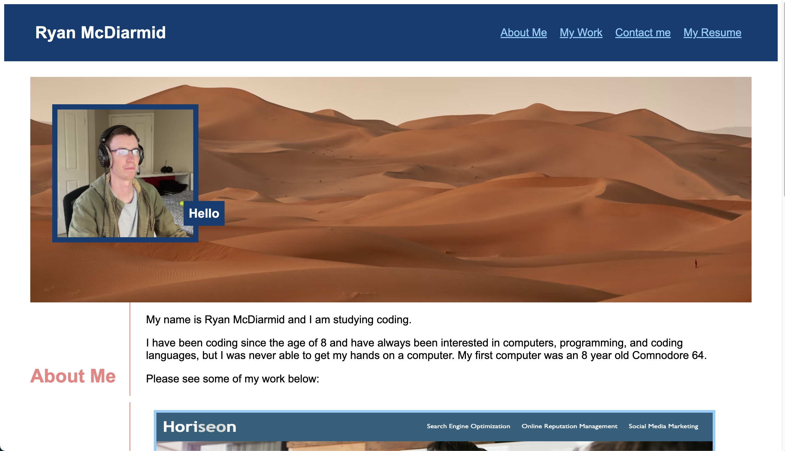

# Ryan McDiarmid's Coding Portfolio

## Description

A portfolio to showcase my skills and talents to potential employers. This portfolio displays apps that I have developed and deployed during my time studying web development.

## Usage
This application can be accessed through a url over the internet. Each section contains information about myself, the projects I have developed and my contact details.

## Credits

## License
Please refer to the LICENSE in the repo